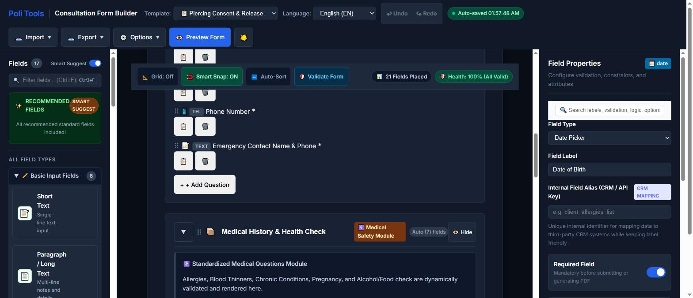
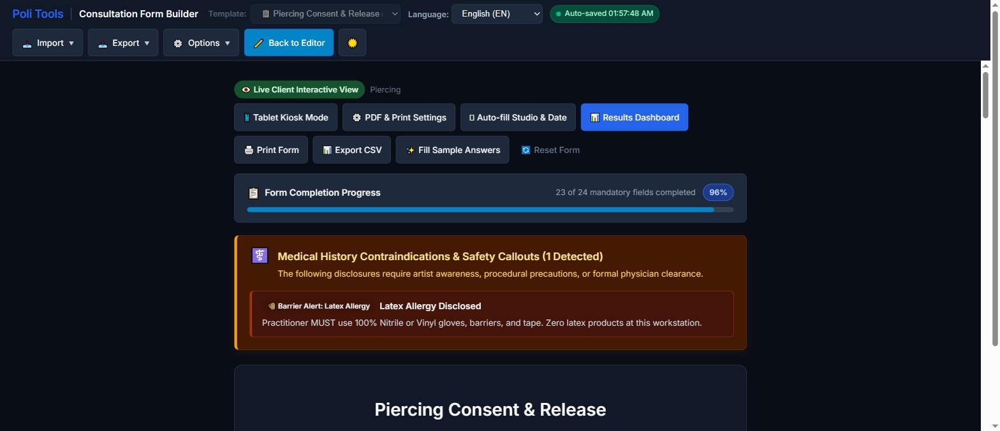
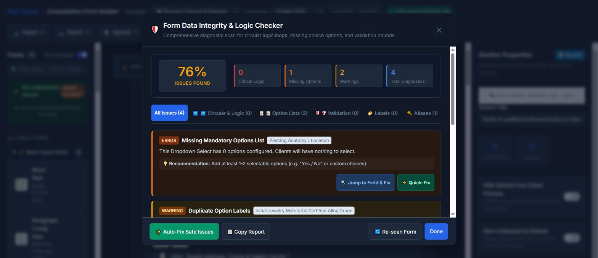

# Consultatieformulier-generator

> Maak, valideer en print toestemmingsformulieren voor tatoeages en piercings. Alles draait in de browser, dus er verlaten geen gezondheidsgegevens van de klant het apparaat.

[](LICENSE)
[](https://github.com/Poli-International/form-builder/commits/master)
[](https://github.com/Poli-International/form-builder/stargazers)

**Live:** <https://poliinternational.com/form-builder/> · **Handleiding:** [`documentation.html`](documentation.html)

[🇬🇧 English](README.md) · [🇫🇷 Français](README.fr.md) · [🇮🇹 Italiano](README.it.md) · [🇩🇪 Deutsch](README.de.md) · [🇪🇸 Español](README.es.md) · 🇳🇱 Nederlands · [🇵🇹 Português](README.pt.md)



---

## Wat het doet

De studio kiest een sjabloon, past het aan op een sleep-en-neerzetcanvas en geeft de klant een tablet of een geprint vel. Geen account, geen backend en geen abonnement.

- **8 sjablonen** — tatoeagetoestemming, piercingtoestemming, medische intake, overeenkomst voor projecten over meerdere sessies, toestemming voor minderjarigen met machtiging van de voogd, beoordeling van cover-ups en herwerk, PMU en cosmetische tatoeage, plus een leeg formulier.
- **17 veldtypen** in vijf categorieën, waaronder een anatomische lichaamskaart om de plaatsing te markeren en een upload voor identiteitsbewijs of document.
- **Voorwaardelijke logica**, zodat vervolgvragen alleen verschijnen wanneer ze relevant zijn.
- **Controle op gegevensintegriteit** die het formulier een score geeft en circulaire logische afhankelijkheden, keuzevelden zonder opties, dubbele optielabels, omgekeerde validatiegrenzen, ongeldige reguliere expressies en dubbele CRM-aliassen meldt.
- **Automatische medische veiligheidsmeldingen**, ontstaan uit de eigen opgaven van de klant.
- **Digitale handtekening** met ondertekeningsdatum, en PDF-export in uw eigen huisstijl.
- **Kioskmodus op tablet** en een printbaar QR-bordje voor de intake aan de balie.
- **Bulkimport via CSV** en een veld-ID-kaart (JSON / CSV / voorbeeld-webhookpayload) om het formulier op een CRM aan te sluiten.
- **7 talen** — Engels, Frans, Italiaans, Duits, Spaans, Nederlands en Portugees. Bij het wisselen van taal worden zowel de bouwer *als* het formulier dat u maakt vertaald.

| | |
|---|---|
|  |  |
| Klantweergave: voortgangsmeter en een automatische melding door een opgegeven latexallergie. | Integriteitscontrole: gescoorde diagnostiek met spring-naar-veld en snelle correctie. |

## Privacy

Dit is de ontwerpbeperking waar het hele gereedschap omheen is gebouwd, en het loont om er precies over te zijn.

Het enige netwerkverzoek van de toepassing is het laden van haar eigen `i18n.json`. Geen analytics, geen telemetrie, geen verzendeindpunt. Formulieren, antwoorden van klanten, handtekeningen en gegenereerde PDF's worden aangemaakt en bewaard in de lokale opslag van de browser en worden nooit verzonden.

De praktische gevolgen:

- Concepten synchroniseren niet tussen machines of browsers, en een privévenster ziet er niets van.
- Het wissen van sitegegevens verwijdert ze definitief. Er is geen kopie aan de serverzijde.
- Omdat de gegevens op het apparaat blijven, **blijft de studio de verwerkingsverantwoordelijke**. Verplichtingen onder de AVG, de PDPA of lokale wetgeving over gezondheidsdossiers veranderen niet, en het bewaren van de geëxporteerde PDF's is de verantwoordelijkheid van de studio.

## Zo draait u het

Geen buildstap en geen afhankelijkheden. Het zijn statische bestanden; serveer de map via HTTP.

```bash
git clone https://github.com/Poli-International/form-builder.git
cd form-builder
python -m http.server 8080
# open daarna http://localhost:8080/
```

Elke statische server volstaat (`npx serve`, `php -S`, nginx, GitHub Pages). `index.html` rechtstreeks vanaf het bestandssysteem openen werkt meestal, maar sommige browsers blokkeren `fetch()` op `file://`, waardoor de interface onvertaald blijft — serveer het liever via HTTP.

### Insluiten op uw eigen site

```html
<iframe src="https://poliinternational.com/tools/form-builder/index.html"
        width="100%" height="1000" frameborder="0"
        style="border-radius:12px;"></iframe>
```

Of host deze repository zelf en laat de iframe naar uw eigen kopie wijzen. Het venster *Opties → Insluiten / QR-code* genereert zowel het fragment als een printbaar QR-bordje.

## Bibliotheken van derden

Meegeleverd in `js/vendor/` op vastgezette versies en lokaal geserveerd in plaats van vanaf een CDN, zodat het gereedschap werkt achter een strikte Content-Security-Policy en niet stukgaat wanneer een `@latest`-tag stroomopwaarts verschuift.

| Bibliotheek | Versie | Gebruikt voor |
|---|---|---|
| [SortableJS](https://github.com/SortableJS/Sortable) | 1.15.6 | Slepen en neerzetten |
| [jsPDF](https://github.com/parallax/jsPDF) | 2.5.1 | Vector-PDF-export |
| [signature_pad](https://github.com/szimek/signature_pad) | 4.1.7 | Handtekening vastleggen |
| [D3](https://github.com/d3/d3) | 7.9.0 | Trendgrafiek van inzendingen |

Om er een bij te werken: download de nieuwe build naar `js/vendor/` en pas de versie in deze tabel aan. Vervang het lokale pad niet door een CDN-URL.

## Documentatie

| Document | Inhoud |
|---|---|
| [`documentation.html`](documentation.html) | Volledige gebruikershandleiding, ook in de app bereikbaar via *Opties → Documentatie* |
| [`docs/USER-GUIDE.md`](docs/USER-GUIDE.md) | Rondleiding functie voor functie |
| [`docs/TECHNICAL-DOCS.md`](docs/TECHNICAL-DOCS.md) | Architectuur, gegevensschema's en moduleoverzicht |
| [`docs/TEMPLATE-GUIDE.md`](docs/TEMPLATE-GUIDE.md) | Schemareferentie voor het schrijven van eigen sjablonen |

## Een opmerking over de sjablonen

De meegeleverde toestemmingssjablonen zijn een **hulpmiddel bij het opstellen, geen juridisch advies**. Vereisten verschillen per land, provincie en gemeente. Laat de definitieve formulering nakijken door iemand die in uw rechtsgebied gekwalificeerd is voordat u die bij klanten gebruikt.

Hetzelfde geldt voor elektronische handtekeningen: ze worden breed erkend, maar de bewijsmaatstaf en de bewaarplicht verschillen. Behandel een geëxporteerde PDF zoals u een ondertekend papieren formulier zou behandelen.

## Bijdragen

Zie [CONTRIBUTING.md](CONTRIBUTING.md). Bugmeldingen en sjabloonbijdragen uit werkende studio's zijn bijzonder welkom: de sjablonen verbeteren het snelst wanneer iemand die de intake daadwerkelijk doet ons vertelt wat er ontbreekt.

## Licentie

[MIT](LICENSE) © Poli International Ltd.

Gemaakt door [Poli International](https://poliinternational.com/), maker van BioFlex®-lichaamssieraden, naast een reeks [gratis professionele hulpmiddelen](https://poliinternational.com/tools/) voor tatoeerders, piercers en studio-eigenaren.
